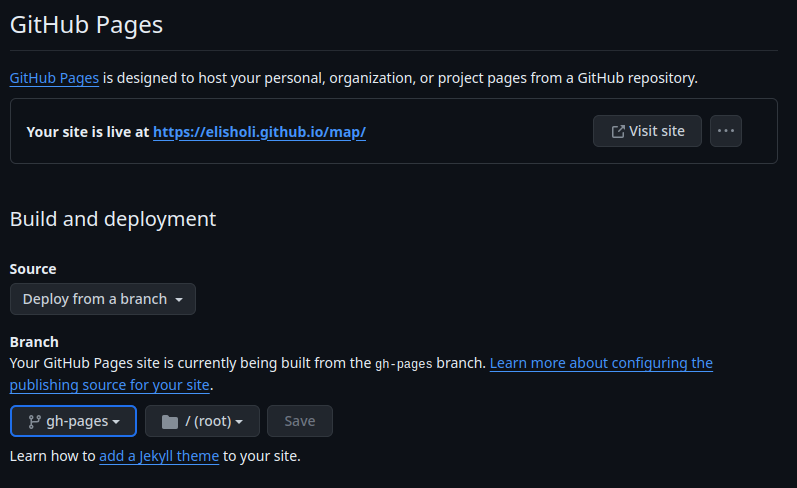

# Prague Integrated Transport - Departure Map

[//]: # (TODO: upravit, jak to funguje)
[//]: # (This application displays departures of buses, trams, and metro in Prague using data from the Prague Integrated Transport API. It updates dynamically, showing departures at specific times from a given stop and informing users about the current status of transportation. Departures are continuously updated, for example, when the departure time changes to departure in 1 minute or when it is indicated that a particular connection has already departed.)

[//]: # (This template should help get you started developing with Vue 3 in Vite.)

> [!NOTE]
> You can find documentation for API at: https://api.golemio.cz/pid/docs/openapi/

## Configuration
The `vite.config.js` file can be modified to configure the application. For more information on configuration options, please refer to the [Vite Configuration Reference](https://vitejs.dev/config/).


## Project setup

### Copy and rename configuration file

```sh
cp .env.local.template .env.local

```

### Generate API key and edit configuration file

Generate your API key at: https://api.golemio.cz/pid/docs/openapi/ and replace it in configuration file.

Add remote URL for your GitHub repository

You can also edit `BASE_URL` if you need.

```sh
# .env.local

# Specifies the environment for development
NODE_ENV=development

# Base URL for the application
BASE_URL=/map/

# API key for accessing the Prague Integrated Transport API
VITE_API_KEY=your_api_key

# Remote URL for the Git repository
GIT_REMOTE_URL=your_remote_url

# Default branch for the Git repository
GIT_DEFAULT_BRANCH=main


```

> [!CAUTION]
> Make sure not to share your API key publicly, as it may lead to unauthorized access to your account or quota limitations. Keep it safe and secure within your project files.


### Install Dependencies

```sh
npm install
```

or update

```sh
npm update
```

### Compile and Hot-Reload for Development

```sh
npm run dev
```

### Compile and Minify for Production

```sh
npm run build
```

## Deployment - GitHub Pages

[//]: # (TODO: vytvoření GH Pages, vytvoření větve pro deploy, nastavení deploye)
### 1) Create new local branch `gh-pages`

### 2) Copy GitHub name of the repository and replace it in config

This is where you will see your application after deployment.

```javascript
// vite.config.js

import { fileURLToPath, URL } from 'node:url'
import { defineConfig } from 'vite'
import vue from '@vitejs/plugin-vue'

// https://vitejs.dev/config/
module.exports =  defineConfig({
  plugins: [vue()],
  resolve: {
    alias: {
      '@': fileURLToPath(new URL('./src', import.meta.url))
    },
  },
  base: "/map/" // REPLACE NAME HERE
})

```

> [!WARNING]
> Make sure that dist is not included in your `.gitignore` file

### 3a) Automated Deployment
To automatically deploy the application, simply run:

```sh
npm run deploy
```
This command will handle both building the application and pushing changes to the remote repository.


### 3b) Manual deployment

#### Add folder dist and commit

```sh
git add dist && git commit -m 'adding dist subtree'
```

#### Remove remote branch and push changes

```sh
git push origin :gh-pages && git subtree push --prefix dist origin gh-pages
```

### 4) Open your GitHub repository in browser and go to `Settings`

### 5) Open section `GitHub Pages` and select `gh-pages` branch and save


### 6) You might have to wait a while and then you can find your page at `https://your_nickname.github.io/name_from_config`